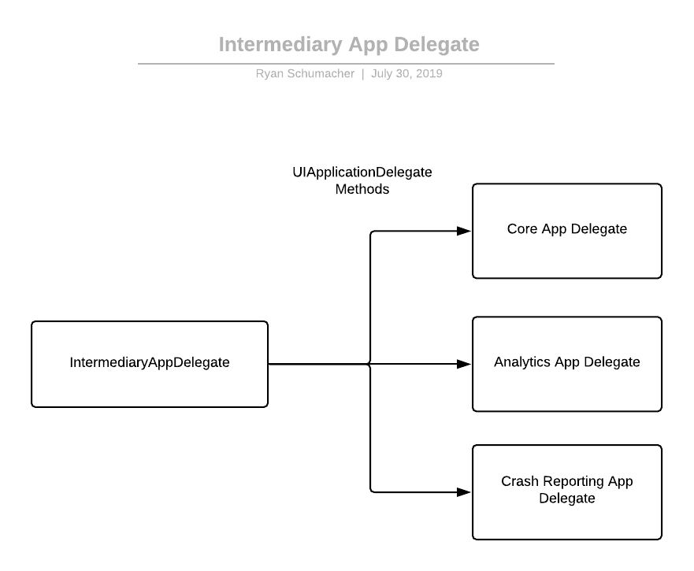

# IntermediaryAppDelegate

IntermediaryAppDelegate is a Swift library for splitting a bloated UIApplicationDelegate into multiple focused UIApplicationDelegates.

For more info, check out my [blog post](https://schustudios.com/blog/Intermediary-App-Delegate).



## Usage

1. Create a main UIApplicationDelegate, and subclass either IntermediaryAppDelegate or RemoteNotificationIntermediaryAppDelegate if you need to support remote notifications. Also, add the ConfigureSceneIntermediaryAppDelegate protocol if using SwiftUI.

```
@UIApplicationMain
class AppDelegate: IntermediaryAppDelegate {
}
```


2. Create the new UIApplicationDelegates where each delegate method will be implemented. Each class should be focused around a single responsibility, like managing the lifecycle of a Crash Reporter, handling Remote Notifications, or responding to Deep Links.

```
class CoreModule: UIResponder, UIApplicationDelegate {
    func application(_ application: UIApplication, didFinishLaunchingWithOptions launchOptions: [UIApplication.LaunchOptionsKey : Any]?) -> Bool {
        return true
    }
}
```


3. Register the App Delegates in the main UIApplicationDelegate. This is done by simply returning each AppDelegate in the init method of the main UIApplicationDelegate like below:

```
@UIApplicationMain
class AppDelegate: RemoteNotificationIntermediaryAppDelegate, ConfigureSceneIntermediaryAppDelegate {

    override init() {
        super.init([CoreModule(),
                    SceneSessionModule(),
                    AppLifeCycleModule(),
                    NotificationModule()])
    }
}
```

Checkout the sample project here: https://github.com/steg132/IntermediaryApp


## Installation

### For Xcode 11:
- Go to `File -> Swift Packages -> Add Project Dependency...`
- Enter `https://github.com/steg132/IntermediaryAppDelegate.git` in search bar.
- Set the version as `1.0.0`


### Via Command line:
- Add `.package(url: "https://github.com/steg132/IntermediaryAppDelegate.git", from: "1.0.0")` to your `Package.swift` file's dependencies. 
- Update your packages using `$ swift package update .`

## Help, Feedback or Suggestions?

- [Open an issue](https://github.com/steg132/IntermediaryAppDelegate/issues/new) if you need help, if you find a bug, of if you have a feature request.
- [Open a PR](https://github.com/steg132/IntermediaryAppDelegate/pulls) if you want to make some changes.
  